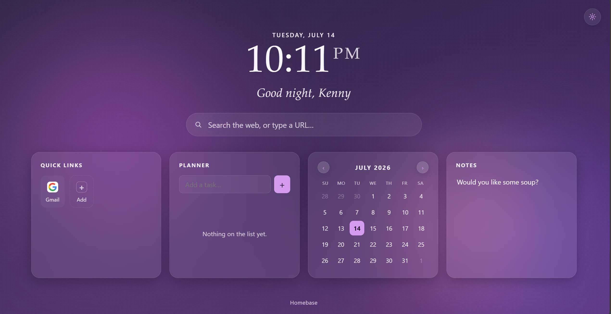

# Homebase — Your new tab is your home.

Replaces your browser's new tab page with a personal homebase: includes some useful widgets + a pleasent Anthropic-like noise gradient look.

Works in Chromium-based browsers (Manifest V3). 
See the note at the bottom for Firefox.

## Installation

1. Unzip this folder somewhere you'll keep it (don't delete it after
   installing — Chrome loads the extension from these files each time).
2. Open `chrome://extensions` in your browser.
3. Turn on **Developer mode** (top-right toggle).
4. Click **Load unpacked**, and select the unzipped `homebase` folder.
5. Open a new tab.

If you ever want to remove it, go back to `chrome://extensions` and click
**Remove** on the Homebase card — your browser's default new tab comes
back immediately. You can also temporarily turn it off via your browser's
extension seetings.

## What's included

- **Living sky** — the background gradient moves through six palettes
  (dawn, morning, midday, dusk, evening, night) that crossfade as your day
  goes on. You can lock it to one mood if you'd like in Settings!
- **Search** — type a query to search the web, or type a URL to go
  straight there. Pick your search engine in Settings. (or just use your
  normal search engine, bar will be removeable soon!)
- **Quick links** — a small grid of your favorite sites. Click **Add** or
  drag a link over the panel to add one; hover a tile to remove it.
- **Planner** — a simple task list: add, check off, delete.
- **Calendar** — a month view. Click any day to add or remove notes/events
  for that date.
- **Notes** — a scratchpad that saves automatically as you type.
- **Settings** (gear icon, top right) — your name for the greeting, sky
  mode, 12/24-hour clock, search engine, and which day the week starts on.

## Development | Customization

Everything is plain HTML/CSS/JS, no building required:

- `css/style.css` — colors, the six sky palettes (search for `--accent` or
  `.sky-scene[data-sky=`), fonts, spacing.
- `js/links.js` — the default starter quick links.
- `js/sky.js` — the hour ranges each sky mode covers.
- `js/*.js` — one small module per feature (planner, calendar, notes,
  links), each self-contained.

Reload the extension from `chrome://extensions` (the circular refresh
icon on the Homebase card) after making changes, then open a new tab to
see them.

## Notes on Firefox

Firefox's WebExtensions support the same `chrome_url_overrides.newtab`
manifest key, so this can likely run there too, but it hasn't been tested
here. You'd add a `browser_specific_settings.gecko.id` entry to
`manifest.json` and load it via `about:debugging` → **This Firefox** →
**Load Temporary Add-on**.

## Privacy

Everything (tasks, links, calendar events, notes, settings) is stored
locally via the browser's extension storage — it stays on your machine
and isn't synced anywhere or sent to any server. The only outside request
this page makes is fetching small site icons for your quick links from
Google's public favicon service.
